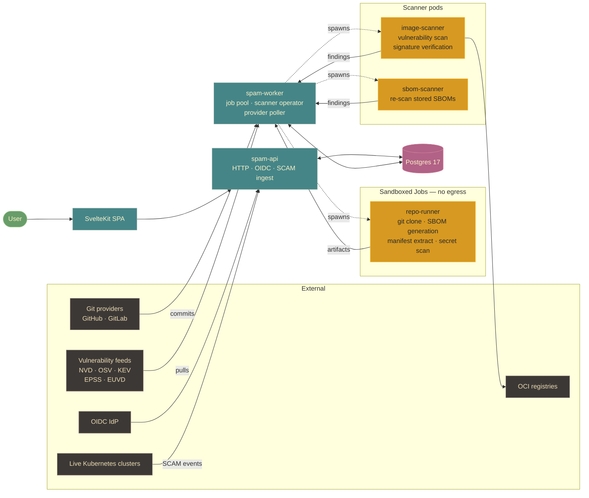

# SPAM — Software Package Asset Management

SPAM is a dashboard for managing third-party software components in any
development or DevSecOps environment — from a single team's repo to a
fleet of clusters across an organization. It aggregates SBOMs and
dependency data from several
in-cluster sources — SBOM generation against cloned source trees and
container image digests, dependency manifests parsed straight out of
source repositories, and live workload data ingested from connected
Kubernetes clusters via SCAM — then enriches the merged graph with
vulnerability data (NVD, OSV, KEV, EPSS, ENISA EUVD) and surfaces
prioritized risk to the people who can act on it.

The project is open-source software developed by Norsk helsenett SF and
distributed under the MIT license.

## Architecture



Two long-lived processes run in-cluster: `spam-api` serves the HTTP API
plus the SvelteKit SPA, and `spam-worker` runs the job queue, the
scanner-pod operator, and the Git provider poller. Everything else is a
short-lived Kubernetes Job that the worker spawns on demand.

## Capabilities

- **OIDC single sign-on** as the only authentication path; no static API tokens.
- **Provider-driven repository ingestion** — operators connect GitHub or
  GitLab once and SPAM auto-discovers repositories, polls for new commits,
  and dispatches scans without per-repo configuration.
- **Sandboxed source scanning** — repository scans run in dedicated
  Kubernetes Jobs with NetworkPolicies that deny all egress except the
  worker callback. Cloned source code never reaches the public internet
  from inside the scanner pod, and a built-in egress self-test verifies
  the policy at pod startup. The pods produce SBOMs, parsed dependency
  manifests, and secret-scan findings.
- **Image vulnerability scanning** — long-lived scanner pods run
  vulnerability scans against image digests with a warm vulnerability
  database, sized by a queue-depth-aware operator.
- **Live cluster awareness via SCAM** — connected clusters stream live
  workload state into SPAM, giving the triage dashboard a real-time view
  of which findings affect actually-running workloads versus dormant code.
- **Vulnerability correlation** — KEV, EPSS, VEX, and EUVD signals are
  joined onto each finding, with cluster-aware exposure shapes for triage.
- **Cosign-based image signature verification** against an admin-configured
  policy.
- **High availability** — both the API and the worker run multi-replica
  with rolling updates and PodDisruptionBudgets out of the box.
- **First-class Helm chart** at `.helm/`, designed to deploy cleanly under
  ArgoCD with all required Secrets and NetworkPolicies generated.

## Repository layout

| Path | Contents |
| --- | --- |
| `api/` | Go backend — `cmd/server` (HTTP API + SPA host) and `cmd/worker` (background jobs, scanner operator, Git provider poller). Chi router, GORM, Postgres. |
| `web/` | SvelteKit frontend (Svelte 5, Tailwind CSS, Gruvbox dark theme). Built statically and served by `cmd/server`. |
| `.helm/` | Helm chart: API and worker Deployments, optional CronJobs for the SBOM and image scanners, NetworkPolicies, RBAC. |
| `runner/` | Container builds for the runner pods (`repo-runner`, `image-scanner`, `sbom-scanner`). |
| `ARCHITECTURE.md` | Component overview and the phased roadmap. |
| `SECURITY.md` | Threat model and reporting process. |

## Prerequisites

- Postgres 17 or newer.
- An OIDC provider (any standards-compliant IdP — Keycloak, Authentik,
  Auth0, Entra ID, Google Workspace, etc.).
- Kubernetes 1.27+ if you intend to run scans. The runner subsystem creates
  Jobs dynamically, and the source-scan NetworkPolicies are required to
  preserve the no-egress sandbox guarantee. The API and worker themselves
  can run anywhere; only the scanning pipeline requires a cluster.
- For local development: a devcontainer-capable editor (VS Code with the
  Dev Containers extension, or any other devcontainers.dev runtime).

## Quick start

### Helm

The supported deployment path is the bundled chart. Minimum viable values:

```yaml
appSecret:
  enabled: true
  oidc:
    issuerUrl: https://login.example.com
    clientId: spam
    clientSecret: <from your IdP>
    redirectUrl: https://spam.example.com/auth/callback

postgresqlConnection:
  host: postgres.example.com
  port: 5432
  sslmode: require

ingress:
  enabled: true
  className: nginx
  hosts:
    - name: spam.example.com
      tls: true
```

Install:

```bash
helm install spam ./.helm -n spam --create-namespace -f my-values.yaml
```

Enable scanning by setting `runner.enabled=true`, `imageScanner.enabled=true`,
and/or `sbomScanner.enabled=true`. See the *Configuration* section below for
the full surface.

### Local development

Local development happens exclusively inside the supplied devcontainer at
`.devcontainer/`. No other environment is supported — the container pins
the Go and Node toolchains, runs a local Postgres, installs Helm, and
starts a `mocc` mock OIDC provider on port `19999` automatically.

Open the repository in any devcontainer-capable editor and let it build
the container. On attach, the SvelteKit dev server starts itself; the API
and worker can then be launched from a terminal inside the container with
`go run ./api/cmd/server` and `go run ./api/cmd/worker`. Point
`OIDC_ISSUER_URL` at the in-container mocc URL — no manual provider setup
is required.

### Verifying changes

Run the project's fast verification commands inside the devcontainer:

```bash
go vet -C api ./...           # Go backend
npm --prefix web run check    # svelte-check on the frontend
```

Standard formatters: `gofmt` for Go, Prettier (with the Tailwind plugin)
for TypeScript and Svelte.

## Operations

Reset the SPAM namespace by deleting all dynamically-created Jobs (useful
after schema changes during development):

```bash
kubectl delete jobs --all -n spam
```

The worker emits the scanner-operator and stale-job reconcilers on a tight
cadence; a fresh pod will rebuild scanner state within a few seconds of
restart.

## License

SPAM is released under the **MIT license** — free to use, distribute, and
modify, including for commercial purposes, with attribution. Copyright
Norsk helsenett SF; full terms in `LICENSE`. Security disclosures: please
follow the process in `SECURITY.md`.

## Configuration

SPAM is configured entirely via environment variables (no CLI flags). When
deployed with the bundled Helm chart, most env vars are set for you from
`.helm/values.yaml`; the chart-key columns below show the wrapper to use.
Defaults shown in code are repeated here — `.helm/values.yaml` may override
them with Helm-specific defaults, noted where they differ.

### Server / API

The `spam-api` binary serves the HTTP frontend, OIDC login, and the SvelteKit
SPA. Almost every setting on this binary is required at startup; the process
will refuse to boot with placeholder secrets in production.

**Database** — point at any Postgres 14+. Either set `DATABASE_URL` directly,
or assemble a DSN from the discrete `POSTGRES_*` vars (the Bitnami Postgres
chart is consumed via the discrete-vars path).

| Env var | Default | Purpose |
| --- | --- | --- |
| `DATABASE_URL` | (built from `POSTGRES_*`) | Full Postgres DSN. Wins over discrete vars when set. |
| `POSTGRES_HOST` | required | Postgres host. |
| `POSTGRES_PORT` | `5432` | Postgres port. |
| `POSTGRES_USER` | required | Postgres user. |
| `POSTGRES_PASSWORD` | empty | Postgres password. |
| `POSTGRES_DB` | required | Database name. |
| `POSTGRES_SSLMODE` | `disable` | `disable` / `require` / `verify-full`. |
| `POSTGRES_TZ` | `UTC` | Session timezone. |
| `POSTGRES_CLIENT_ENCODING` | `UTF8` | Client encoding. |

**HTTP & SPA** — the API serves both `/api/*` JSON and the static SvelteKit
build out of one process.

| Env var | Default | Purpose |
| --- | --- | --- |
| `HTTP_PORT` | `8080` | Listener port. |
| `SPA_DIST_DIR` | auto-discovered | Path to the SvelteKit `build/` output. |
| `WEB_DIST_DIR` | auto-discovered | Fallback path searched when `SPA_DIST_DIR` is unset. |

**OIDC & sessions** — the only supported login path is OIDC. Cookies are
encrypted *and* signed; both keys are required and must be base64-encoded
of the right length (32 bytes for hash, 16/24/32 for block). The Helm chart
generates these into a Secret automatically when `appSecret.enabled=true`.

| Env var | Default | Purpose |
| --- | --- | --- |
| `OIDC_ISSUER_URL` | required | Provider discovery URL (e.g. `https://login.example.com`). |
| `OIDC_CLIENT_ID` | required | OAuth client ID. |
| `OIDC_CLIENT_SECRET` | required | OAuth client secret. |
| `OIDC_REDIRECT_URL` | required | Callback URL registered with the provider. |
| `OIDC_SCOPES` | `openid profile email` | Space- or comma-separated. |
| `SESSION_COOKIE_NAME` | `spam_session` | Session cookie name. |
| `AUTH_STATE_COOKIE_NAME` | `spam_oidc` | Short-lived OIDC state cookie. |
| `SESSION_TTL` | `8h` | Session lifetime (Go duration). |
| `SESSION_COOKIE_HASH_KEY` | required | Base64 HMAC key (≥32 bytes). |
| `SESSION_COOKIE_BLOCK_KEY` | required | Base64 AES key (16/24/32 bytes). |
| `COOKIE_SECURE` | `true` | Set Secure flag on cookies. Disable only for plain-HTTP local dev. |

**Provider secrets & feature toggles**

| Env var | Default | Purpose |
| --- | --- | --- |
| `PROVIDER_SECRETS_KEY` | auto-generated | Base64 AES key encrypting Git provider PATs at rest. Persist this — losing it makes stored PATs unrecoverable. |
| `RUNNER_HMAC_KEY` | required if `RUNNER_ENABLED=true` | Base64 HMAC key (≥32 bytes) signing run tokens issued to runner pods. |
| `SPAM_EUVD_ENABLED` | `true` | Fetch the ENISA EUVD vulnerability supplement. Disable to stay on NVD/OSV only. |
| `SPAM_CLUSTER_LIVE_WINDOW` | `24h` | How long a cluster session is treated as "live" by the SCAM dashboard (Go duration). |
| `SPAM_HOSTMETA_BLOCK_CIDRS` | empty | Extra CIDRs to add to the SSRF blocklist (comma-separated, e.g. `172.16.0.0/12,10.0.0.0/8`). The cloud-metadata endpoints (`169.254.169.254` etc.) are always blocked. |
| `SPAM_SEED_SQL` | empty | Comma-separated paths to SQL files run on startup. **Dev only** — do not point at this in production. |

### Worker

The `spam-worker` binary processes the job queue (`CREATE_RUN`, `FETCH_KEV`,
`VULN_META_FETCH`, `IMAGE_SCAN`, …), polls Git providers for new commits,
and runs the scanner-pod operator. There are two independent goroutine pools
inside one process: the **main pool** (everything except `VULN_META_FETCH`
and `IMAGE_SCAN`) and the **vuln-meta pool**. The main pool intentionally
excludes `IMAGE_SCAN` because those jobs are claimed by dedicated scanner
pods, not by the worker itself (see *Image scanner* below).

| Env var | Default | Purpose |
| --- | --- | --- |
| `WORKER_CONCURRENCY` | `4` | Main job pool size. Drives `CREATE_RUN` dispatch, feed refreshes, sync jobs. |
| `WORKER_VULN_META_CONCURRENCY` | `8` | Dedicated pool for `VULN_META_FETCH`. Isolated so a large backfill (tens of thousands of jobs after a fresh OSV scan) can't FIFO-starve user-facing dispatches. |

The worker also reuses the database, secrets, OIDC and runner env vars from
the API section — they're loaded by the same `config.LoadWorker` path.

### Runner subsystem

When `RUNNER_ENABLED=true`, the worker dynamically creates Kubernetes Jobs
to clone repositories and run scans inside short-lived pods. The vars below
are read by the **worker** to template those Jobs; the resulting pods then
receive their own env vars (see *Runner pod env* further down).

| Env var | Default | Purpose |
| --- | --- | --- |
| `RUNNER_ENABLED` | `false` | Master switch. |
| `RUNNER_IMAGE` | `spam-repo-runner:latest` | Image used for repo-clone jobs. |
| `RUNNER_NAMESPACE` | `default` | Namespace runner jobs are created in. |
| `RUNNER_SERVICE_ACCOUNT` | `spam-runner` | ServiceAccount on runner pods. |
| `RUNNER_WORKER_URL` | `http://localhost:8081` | Internal callback URL the runner pod posts results back to. |
| `RUNNER_HTTP_PORT` | `8081` | Listener port for the worker's runner-callback endpoint. |
| `RUNNER_TTL_SECONDS` | `3600` | TTL applied to completed K8s Jobs. |
| `RUNNER_ACTIVE_DEADLINE` | `1800` | Hard runtime cap (seconds) per Job. Worker stale-job timeout derives from this + buffer. |
| `RUNNER_KUBECONFIG` | empty | Path to kubeconfig. Empty = use in-cluster config. |
| `RUNNER_POD_ANNOTATIONS` | empty | Extra annotations on runner pods, format `KEY1=VAL1,KEY2=VAL2`. The worker's own pod annotations are inherited automatically. |
| `RUNNER_IMAGE_SCAN_ENV` | empty | Extra env vars forwarded to image-scan pods, same format. Typical keys: `GRYPE_DB_UPDATE_URL`, `GRYPE_DB_AUTO_UPDATE`, `TRIVY_DB_REPOSITORY`, `TRIVY_JAVA_DB_REPOSITORY`. |
| `RUNNER_EGRESS_SELF_TEST_ENABLED` | `false` | At runner startup, hit a known URL to verify the NetworkPolicy lets the pod talk out as expected. |
| `RUNNER_EGRESS_SELF_TEST_URL` | `https://example.com` | Target of the self-test. |
| `RUNNER_EGRESS_SELF_TEST_TIMEOUT_SECONDS` | `5` | Self-test timeout. |
| `SPAM_RELEASE_NAME` | empty | Helm release name; injected onto runner pods so ArgoCD groups them with the worker Application. |
| `SPAM_CHART_NAME` | empty | Helm chart name (same purpose). Empty = label omitted. |

### Image scanner

When `IMAGE_SCAN_ENABLED=true`, the worker runs an **operator loop** that
spawns dedicated `spam-image-scanner` pods to claim `IMAGE_SCAN` jobs. Each
pod warms its own grype/trivy vulnerability DB on start, then *lingers*
after draining the queue so short bursts amortise that DB download.

The four operator settings have Helm wrappers under `imageScanner.operator`;
the table below shows both forms. Effective parallelism is
`min(maxParallelism, queue depth)`, so raising the cap only helps when there
is a backlog and the cluster has capacity.

| Helm value | Env var | Default | Purpose |
| --- | --- | --- | --- |
| `imageScanner.operator.maxParallelism` | `IMAGE_SCAN_MAX_PARALLELISM` | `2` | Upper bound on concurrent scanner pods. |
| `imageScanner.operator.spawnSpacingSeconds` | `IMAGE_SCAN_SPAWN_SPACING_SECONDS` | `2` | Delay between successive pod creations on a backlog. `0` = back-to-back. |
| `imageScanner.operator.lingerIdleMax` | `SCANNER_LINGER_IDLE_MAX` | `30m` | How long a pod keeps polling an empty queue before exiting. Active scans reset the timer. |
| `imageScanner.operator.pollInterval` | `SCANNER_POLL_INTERVAL` | `15s` | Lingering-pod queue poll cadence. |

Other vars used by the operator on the **worker** side:

| Env var | Default | Purpose |
| --- | --- | --- |
| `IMAGE_SCAN_ENABLED` | `false` | Master switch for image scanning. |
| `IMAGE_SCAN_CRONJOB_NAME` | (set by chart) | Name of the suspended CronJob whose pod template the operator clones for scanner pods. |

### SBOM scanner

A simpler companion to the image scanner: a CronJob that wakes on a schedule
and runs the SBOM-scanner image to (re)scan stored SBOMs against current
vulnerability data. There is no operator loop and no persistent pod — pods
are created by Kubernetes on the cron schedule.

| Env var | Default | Purpose |
| --- | --- | --- |
| `SBOM_SCANNER_CRONJOB_NAME` | (set by chart) | Name of the CronJob the worker references when triggering ad-hoc scans. |

### Scanner / runner pod env

These vars are set by the worker on the pods it spawns (image-scanner,
sbom-scanner, repo-runner). Most operators won't set them by hand; they're
documented here so the runtime contract between worker and pod is visible.

| Env var | Default | Component | Purpose |
| --- | --- | --- | --- |
| `SPAM_API_URL` | required | image-scanner, sbom-scanner | Worker URL the pod calls to lease and complete jobs. |
| `RUNNER_HMAC_KEY` | required | image-scanner, sbom-scanner | Shared HMAC key for signing lease requests. |
| `WORKER_URL` | required | repo-runner | Worker callback URL for run results. |
| `RUN_ID` | required | repo-runner | Unique run identifier. |
| `RUN_TOKEN` | required | repo-runner | HMAC-signed bearer token for that one run. |
| `REPO_CLONE_URL` | required | repo-runner | Git URL to clone. |
| `REPO_REF` | empty | repo-runner | Branch / tag / ref to check out. |
| `REPO_COMMIT_SHA` | empty | repo-runner | Pin to a specific commit. |
| `RUNNER_MODE` | `scan` | repo-runner | `clone` for the init container, `scan` for the main container. |
| `WORK_DIR` | `/work` | image-scanner | Scratch directory. |
| `SCAN_DEADLINE_SECONDS` | `900` | image-scanner | Per-digest scan timeout. |
| `GRYPE_DB_CACHE_DIR` | `/grype-cache` | image-scanner | Grype DB cache mount. |
| `TRIVY_CACHE_DIR` | `/trivy-cache` | image-scanner | Trivy DB cache mount. |
| `POD_NAME` / `POD_NAMESPACE` | downward API | all | Pod identity used in lease/heartbeat records. |

## Helm values

`.helm/values.yaml` is the canonical operator-facing surface. The keys below
are grouped by concern; defaults match the file unless noted. Sub-keys not
listed here are usually mechanical (resources, labels, image refs) — read
the values file for the full leaf-level detail.

**Core deployment** — `replicaCount` (API pods, raise for HA), `image.{repository,tag,pullPolicy}`,
`strategy` (rolling-update tuning), `pdb.{enabled,minAvailable}`, plus the
usual `nodeSelector` / `tolerations` / `affinity` / `resources` /
`podAnnotations` / `podLabels` knobs. `extraResources` accepts arbitrary
manifests rendered alongside the chart (Gateway API objects, custom CRDs,
etc.).

**`appSecret`** — auto-generated Kubernetes Secret holding OIDC client
credentials and session keys. Set `appSecret.enabled=true` and fill in
`oidc.{issuerUrl,clientId,clientSecret,redirectUrl}` (and optionally
`oidc.scopes`). Session keys (`session.cookieHashKey`,
`session.cookieBlockKey`) are auto-generated when empty. Use
`existingSecret` to point at a Secret you manage yourself; set `immutable`
to lock it.

**`providerSecrets`** — separate Secret holding `PROVIDER_SECRETS_KEY`,
which encrypts stored provider PATs. Defaults to `immutable: true` —
**rotating it makes existing PATs unrecoverable**, which is why the chart
treats it as write-once.

**`postgresql`** — set `postgresql.enabled=true` to deploy the Bitnami
Postgres subchart in-cluster (dev / single-node use). Production should
leave it disabled and point `postgresqlConnection.{host,port,sslmode}` at
an external instance with credentials in `appSecret` or an existing Secret.

**`service` / `ingress`** — `service.{enabled,type,port}` for the
ClusterIP / LoadBalancer / NodePort decision. `ingress.enabled` plus
`ingress.className` and `ingress.hosts[]` for HTTP routing; per-host `tls`
flag enables TLS termination via referenced Secret.

**Health & security** — `startupProbe`, `livenessProbe`, `readinessProbe`
each take the standard `httpGet` / `periodSeconds` / `failureThreshold`
shape. `podSecurityContext` (runAsNonRoot, fsGroup, seccompProfile) and
`securityContext` (allowPrivilegeEscalation, readOnlyRootFilesystem,
dropped capabilities) ship locked-down by default.

**`worker`** — `enabled` (default `true`), `replicaCount` (default `2`),
`strategy`, `pdb`, `resources`, and `concurrency.{main,vulnMeta}`
(defaults `4` and `8`, mapped to `WORKER_CONCURRENCY` and
`WORKER_VULN_META_CONCURRENCY`).

**`runner`** — opt-in (`enabled: false`). When on:
`image.{repository,tag}`, `httpPort`, `hmacKey` (auto-generated when
empty), `serviceAccount.{create,name}`, `ttlSecondsAfterFinished`,
`activeDeadlineSeconds`, and `egressSelfTest.{enabled,url,timeoutSeconds}`.
`secretImmutable` locks the generated HMAC Secret. Resources default to
modest CPU / 2Gi memory limits.

**`sbomScanner`** — opt-in. `schedule` (cron string, default `0 6 * * *`),
`parallelism` (default `3`), `activeDeadlineSeconds` (4h), plus the usual
image and resources fields.

**`imageScanner`** — opt-in. The full `operator.*` block is documented in
the *Image scanner* section above. Pod-level knobs:
`activeDeadlineSeconds` (3h hard cap), `scanDeadlineSeconds` (per scan,
15m), the four emptyDir size limits (`tmpSizeLimit`, `workSizeLimit`,
`grypeCacheSizeLimit`, `trivyCacheSizeLimit`), and `extraEnv` for forwarding
custom DB-mirror URLs into grype / trivy.

**`networkPolicy`** — separate NetworkPolicy generated for each scanner /
runner. `runner.enabled` (default `true`) gates the runner policy;
`runner.additionalEgressRules`, `sbomScanner.additionalEgressRules`, and
`imageScanner.additionalEgressRules` let you append rules on top of the
built-in defaults (DNS + worker API; scanners also get HTTPS to the public
internet for advisory feeds).

**`hostmeta.blockCIDRs`** — extra CIDRs added to the SSRF blocklist (maps
to `SPAM_HOSTMETA_BLOCK_CIDRS`). Cloud-metadata addresses are blocked
unconditionally regardless of this list.
